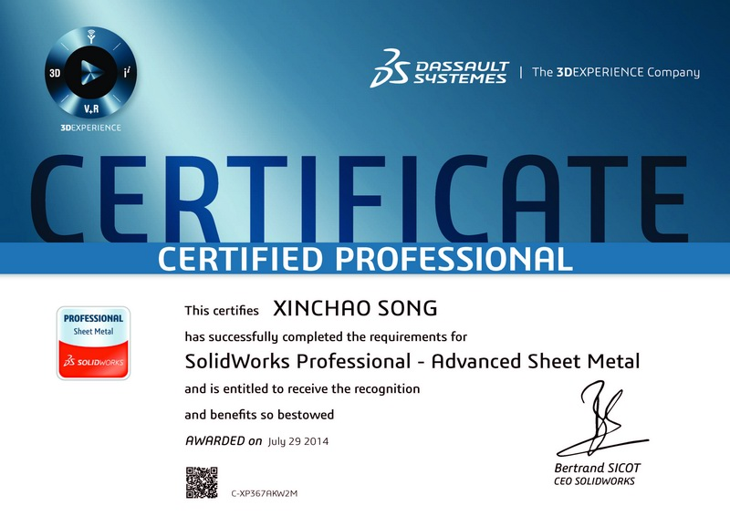

# Certifications

### Certified SOLIDWORKS Professional (CSWP) - Mechanical Design

 The CSWP exam is a comprehensive, non-proctored online exam that tests an individual’s ability to design and analyze parametric parts and movable assemblies using a variety of complex features in SOLIDWORKS, including design validation tools. A Certified SOLIDWORKS Professional is an individual that has successfully passed this exam.

{:style="clear: left"}
 
