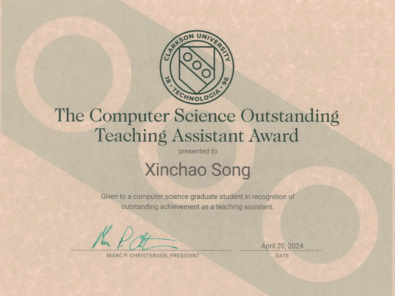
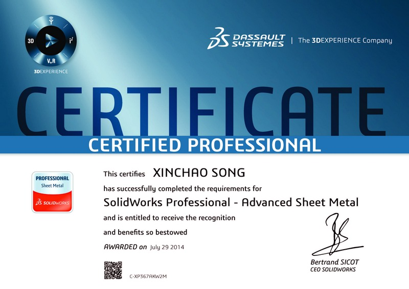
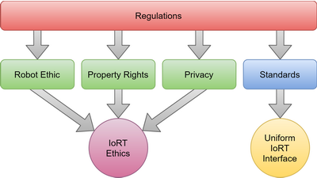

# Education

### Ph.D. Student in Computer Science

Clarkson University, Potsdam, New York, 2021 - Present

### Master of Science in Computer Science

Northeastern University, Boston, Massachusetts, 2020

### Master of Science in Mechanical Engineering

Northeastern University, Boston, Massachusetts, 2014

### Bachelor of Engineering in Mechatronics Engineering

Tianjin University of Science and Technology, Tianjin, China, 2011

* * *

# Experience

### Ph.D. Research Assistant

[Terascale All-sensing Research Studio (TARS)](https://tars-home.github.io/) at Clarkson University, Potsdam, New York, 2021 - Present

- Conduct research on deep learning based robotic assembly and multimodal sensing for human-robot interaction.

### Graduate Research Assistant

[Helping Hands Lab](https://www2.ccs.neu.edu/research/helpinghands/) at Northeastern University, Boston, Massachusetts, 2019 - 2021

- Developed robot learning approaches, implemented novel benchmark learning domains, and performed Sim2Real for robotic manipulation.

### Mechatronics Engineer

Perfetch, Malden, Massachusetts, 2015 - 2017

- Designed and prototyped the mechatronic systems of full-color 3D body scanners for fitness and healthcare applications.

### R&D Engineer

Biomille Technologies, Boston, Massachusetts, 2014 - 2015

- Designed and prototyped a head mount system for a facial rehabilitation device.

* * *

# Teaching

### Graduate Teaching Assistant

Clarkson University, Potsdam, New York, 2021 - Present

- CS242 Advanced Programming Concepts in Java (Fall 2021-2023)
- CS444/CS544 Operating Systems (Spring 2022-2024)
- CS451/CS551 Artificial Intelligence (Fall 2023)
- CS460/CS560/EE468/EE568 Database Systems (Spring 2024)

### Lead Graduate Teaching Assistant

Northeastern University Khoury College of Computer Sciences, Boston, Massachusetts, 2018 - 2021

- CS3520 Programming in C++ (Spring 2020)
- CS5004 Object-Oriented Design (Summer 2018-2019)
- CS5008 Data Structures, Algorithms, and Their Applications within Computer Systems (Spring 2021)
- IS1500 Introduction to Web Development (Fall 2019-2020)
- DS5010 Introduction to Programming for Data Science (Fall 2018, Spring 2019)

* * *

# Honors & Awards

### Clarkson University Computer Science Outstanding Teaching Assistant Award

 This award is given to a computer science graduate student in recognition of outstanding achievement as a teaching assistant.

{:style="clear: right"}
&nbsp;

* * *

# Certifications

### Certified SOLIDWORKS Professional (CSWP) - Mechanical Design

 The CSWP exam is a comprehensive, non-proctored online exam that tests an individual’s ability to design and analyze parametric parts and movable assemblies using a variety of complex features in SOLIDWORKS, including design validation tools. A Certified SOLIDWORKS Professional is an individual that has successfully passed this exam.

{:style="clear: right"}
&nbsp;

### FCC Amateur Radio Service License - Technician

The FCC Amateur Radio Service Technician class license is the entry-level license that gives access to all Amateur Radio frequencies above 30 megahertz, allowing these licensees the ability to communicate locally and most often within North America. It also allows for some limited privileges on the HF bands used for international communications.

* * *

# Publications

### Pix2Repair: Implicit Shape Restoration from Images

**<u>Xinchao Song</u>**\*, Nikolas Lamb\*, Sean Banerjee, Natasha Kholgade Banerjee. *arXiv preprint:2305.18273*. [[Paper](https://arxiv.org/abs/2305.18273)]

We present Pix2Repair, an automated shape repair approach that generates restoration shapes from images to repair fractured objects. Pix2Repair takes an image of the fractured object as input and automatically generates a 3D printable restoration shape. We contribute a novel shape function that deconstructs a latent code representing the fractured object into a complete shape and a break surface. We also introduce Fantastic Breaks Imaged, the first large-scale dataset of 11,653 real-world images of fractured objects for training and evaluating image-based shape repair approaches.

### Reinforcement-Learning Based Robotic Assembly of Fractured Objects Using Visual and Tactile Information

**<u>Xinchao Song</u>**\*, Nikolas Lamb\*, Sean Banerjee, Natasha Kholgade Banerjee. *2023 International Conference on Automation, Robotics and Applications (ICARA)*. [[Paper](https://ieeexplore.ieee.org/document/10125938)]

<iframe class="list-video-right" width="400" height="225" src="https://www.youtube.com/embed/vXi9ogqOqMk" frameborder="0" allow="accelerometer; autoplay; encrypted-media; gyroscope; picture-in-picture" allowfullscreen></iframe>

We present a reinforcement learning approach that combines visual and tactile information to automatically assemble repair parts to fractured objects. We propose two novel visual metrics, which we term pixel offset error and assembly error, to provide estimation of assembly state. Our approach does not place constraints on object geometry and estimates the assembly state of the constituent objects in real time. We show tightly assembled fractured and restored pairs in simulation and on real robots.

&nbsp;

### Internet of Robotic Things: Current Technologies, Applications, Challenges and Future Directions

Davide Villa, **<u>Xinchao Song</u>**, Matthew Heim, Liangshe Li. *arXiv preprint:2101.06256*. [[Paper](https://arxiv.org/abs/2101.06256)]

The concept of the Internet of Things (IoT) is becoming increasingly popular, with the number of connected devices reaching billions. This paper focuses on the fusion of IoT and robotics, called the Internet of Robotic Things (IoRT), and discusses IoRT concepts, architectures, use case examples, key challenges, ethical issues, regulations, and future vision. This paper aims to provide a better understanding of the emerging concept of IoRT, its benefits and limitations, as well as guidelines and directions for future research and studies.

&nbsp;

### Belief-Grounded Networks for Accelerated Robot Learning under Partial Observability

Hai Nguyen\*, Brett Daley\*, **<u>Xinchao Song</u>**, Chistopher Amato, Robert Platt. *2020 Conference on Robot Learning (CoRL)*. [[website](https://sites.google.com/view/bgn-pomdp)]

<iframe class="list-video-right" width="400" height="225" src="https://www.youtube.com/embed/06OJReBYNls" frameborder="0" allow="accelerometer; autoplay; encrypted-media; gyroscope; picture-in-picture" allowfullscreen></iframe>

We propose a method for policy learning under partial observability called the Belief-Grounded Network (BGN) in which an auxiliary belief-reconstruction loss incentivizes a neural network to concisely summarize its input history. Since the resulting policy is a function of the history rather than the belief, it can be executed easily at runtime. We compare BGN against several baselines on classic benchmark tasks as well as three novel robotic touch-sensing tasks. BGN outperforms all other tested methods and its learned policies work well when transferred onto a physical robot.
