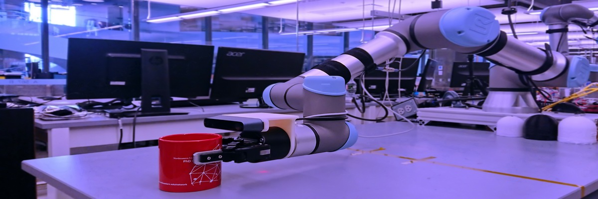

# About Me

I am currently a Research Assistant advised by Prof. Robert Platt in the Khoury College of Computer Sciences at Northeastern University. I have two master's degrees in computer science and mechanical engineering respectively with several years' relevant working and research experience. My research interest is robotics and machine learning with a focus on perception, planning, control, and manipulation, especially from an interdisciplinary perspective of software and hardware. My recent research is focusing on the applications of deep reinforcement learning to robotic tactile and force sensing.

* * *

# Education

### Ph.D. Student in Computer Science

Clarkson University, Potsdam, NY, 2025 (expected)

### Master of Science in Computer Science

Northeastern University Khoury College of Computer Sciences, Boston, MA, 2020

### Master of Science in Mechanical Engineering

Northeastern University College of Engineering, Boston, MA, 2014

### Bachelor of Engineering in Mechatronics Engineering

Tianjin University of Science and Technology, Tianjin, China, 2011

* * *

# Experience

### Graduate Research Assistant in Robotics

Terascale All-sensing Research Studio at Clarkson University, Potsdam, NY, 2021 - Present

### Graduate Research Assistant in Robotics

Helping Hands Lab at Northeastern University, Boston, MA, 2019 - Present

- Conduct research on the applications of deep reinforcement learning to robotic tactile and force sensing.

### Lead Teaching Assistant in Computer Sciences

Northeastern University Khoury College of Computer Sciences, Boston, MA, 2018 - 2021

- Assisted in several courses in computer science and data science, see the teaching section for details.

### Mechatronics Engineer

Perfetch LLC, Malden, MA, 2015 - 2017

- Developed and prototyped the mechatronics systems for the 3D scanners for the human body.

### Mechanical Engineer

Biomille Technologies, Boston, MA, 2014 - 2015

- Designed and prototyped a bracket system for a medical device for facial rehabilitation.

### Undergraduate Research Assistant in Robotics

Tianjin University of Science and Technology, Tianjin, China, 2010 - 2011

- Conducted research on motion control approaches to the indoor navigation and exploration of autonomous mobile four-wheeled robots.
