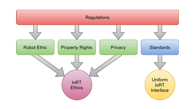

# About Me

I am currently a Ph.D. Student in Computer Science at Clarkson University, Potsdam, New York. My advisers are [Prof. Sean Banerjee](https://www.clarkson.edu/people/sean-banerjee) and [Prof. Natasha Banerjee](https://www.clarkson.edu/people/natasha-banerjee). Before joining Clarkson, I received my master's degree in computer science at Northeastern University, Boston, Massachusetts, where I was advised by [Prof. Robert Platt](https://www.khoury.northeastern.edu/people/robert-platt/). I also worked in the mechanical engineering field for many years with a master of science in mechanical engineering.

My research interest is robotics and deep learning with a focus on multimodal perception, planning, control, and manipulation, especially from an interdisciplinary perspective of software and hardware.

* * *

# Education

### Ph.D. Student in Computer Science

Clarkson University, Potsdam, New York, 2021 - Present

### Master of Science in Computer Science

Northeastern University, Boston, Massachusetts, 2020

### Master of Science in Mechanical Engineering

Northeastern University, Boston, Massachusetts, 2014

### Bachelor of Engineering in Mechatronics Engineering

Tianjin University of Science and Technology, Tianjin, China, 2011

* * *

# Experience

### Ph.D. Research Assistant in Robotics

[Terascale All-sensing Research Studio (TARS)](https://tars.clarkson.edu/) at Clarkson University, Potsdam, New York, 2021 - Present

- Conduct research on deep learning based robotic assembly and multimodal sensing for human-robot interaction.

### Graduate Teaching Assistant in Computer Sciences

Clarkson University, Potsdam, New York, 2021 - Present

- CS 242: Advanced Programming Concepts in Java (Fall 2021-2023)
- CS 444/544: Operating Systems (Spring 2022-2023)
- CS 451/551 Artificial Intelligence (Fall 2023)

### Graduate Research Assistant in Robotics

[Helping Hands Lab](https://www2.ccs.neu.edu/research/helpinghands/) at Northeastern University, Boston, Massachusetts, 2019 - 2021

- Developed robot learning approaches, implemented novel benchmark learning domains, and performed Sim2Real for robotic manipulation.

### Lead Graduate Teaching Assistant in Computer Sciences

Northeastern University Khoury College of Computer Sciences, Boston, Massachusetts, 2018 - 2021

- CS 3520: Programming in C++ (Spring 2020)
- CS 5004: Object-Oriented Design (Summer 2018-2019)
- CS 5008: Data Structures, Algorithms, and Their Applications within Computer Systems (Spring 2021)
- IS 1500: Introduction to Web Development (Fall 2019-2020)
- DS 5010: Introduction to Programming for Data Science (Fall 2018, Spring 2019)

### Mechatronics Engineer

Perfetch, Malden, Massachusetts, 2015 - 2017

- Designed and prototyped the mechatronic systems of full-color 3D body scanners for fitness and healthcare applications.

### R&D Engineer

Biomille Technologies, Boston, Massachusetts, 2014 - 2015

- Designed and prototyped a head mount system for a facial rehabilitation device.

### Undergraduate Research Assistant in Robotics

Tianjin University of Science and Technology, Tianjin, China, 2010 - 2011

- Conducted research on motion control approaches to the indoor navigation and exploration of autonomous mobile four-wheeled robots.

* * *

# Publications

### Reinforcement-Learning Based Robotic Assembly of Fractured Objects Using Visual and Tactile Information

**<u>Xinchao Song</u>**\*, Nikolas Lamb\*, Sean Banerjee, Natasha Kholgade Banerjee. *2023 International Conference on Automation, Robotics and Applications (ICARA)*. [[Paper](https://ieeexplore.ieee.org/document/10125938)]

<iframe class="list-video-right" width="400" height="225" src="https://www.youtube.com/embed/vXi9ogqOqMk" frameborder="0" allow="accelerometer; autoplay; encrypted-media; gyroscope; picture-in-picture" allowfullscreen></iframe>

We present a reinforcement learning approach that combines visual and tactile information to automatically assemble repair parts to fractured objects. We propose two novel visual metrics, which we term pixel offset error and assembly error, to provide estimation of assembly state. Our approach does not place constraints on object geometry and estimates the assembly state of the constituent objects in real time. We show tightly assembled fractured and restored pairs in simulation and on real robots.

&nbsp;

### Internet of Robotic Things: Current Technologies, Applications, Challenges and Future Directions

Davide Villa, **<u>Xinchao Song</u>**, Matthew Heim, Liangshe Li. *arXiv preprint:2101.06256*. [[Paper](https://arxiv.org/abs/2101.06256)]

The concept of the Internet of Things (IoT) is becoming increasingly popular, with the number of connected devices reaching billions. This paper focuses on the fusion of IoT and robotics, called the Internet of Robotic Things (IoRT), and discusses IoRT concepts, architectures, use case examples, key challenges, ethical issues, regulations, and future vision. This paper aims to provide a better understanding of the emerging concept of IoRT, its benefits and limitations, as well as guidelines and directions for future research and studies.

&nbsp;

### Belief-Grounded Networks for Accelerated Robot Learning under Partial Observability

Hai Nguyen\*, Brett Daley\*, **<u>Xinchao Song</u>**, Chistopher Amato, Robert Platt. *2020 Conference on Robot Learning (CoRL)*. [[website](https://sites.google.com/view/bgn-pomdp)]

<iframe class="list-video-right" width="400" height="225" src="https://www.youtube.com/embed/06OJReBYNls" frameborder="0" allow="accelerometer; autoplay; encrypted-media; gyroscope; picture-in-picture" allowfullscreen></iframe>

We propose a method for policy learning under partial observability called the Belief-Grounded Network (BGN) in which an auxiliary belief-reconstruction loss incentivizes a neural network to concisely summarize its input history. Since the resulting policy is a function of the history rather than the belief, it can be executed easily at runtime. We compare BGN against several baselines on classic benchmark tasks as well as three novel robotic touch-sensing tasks. BGN outperforms all other tested methods and its learned policies work well when transferred onto a physical robot.

&nbsp;

### Imitation Learning in POMDPs with Contacts

Hai Nguyen, **<u>Xinchao Song</u>**, Christopher Amato, and Robert Platt. *2020 Robotics: Science and Systems (RSS): Reacting to Contact Workshop*. [[pdf](http://mlab.ri.cmu.edu/reacting_contact_workshop/files/hai_nguyen.pdf)]

<iframe class="list-video-left" width="400" height="225" src="https://www.youtube.com/embed/OgJq-AVdJc0" frameborder="0" allow="accelerometer; autoplay; encrypted-media; gyroscope; picture-in-picture" allowfullscreen></iframe>

We use the access to full states during training and imitation learning to train an intelligent agent that uses contacts to explore to solve a manipulation task. We formulate the problem as a partially observable decision process (POMDP) and solve it using imitation learning. We train a POMDP expert that solves the task while performing informative actions using contacts as well as an agent that acts on partial information by cloning this expert’s behavior. We test our method on a novel robotics domain and set up an experiment with a real robot.

* * *

# Certifications

### Certified SOLIDWORKS Professional (CSWP) - Mechanical Design

 The CSWP exam is a comprehensive, non-proctored online exam that tests an individual’s ability to design and analyze parametric parts and movable assemblies using a variety of complex features in SOLIDWORKS, including design validation tools. A Certified SOLIDWORKS Professional is an individual that has successfully passed this exam.

{:style="clear: left"}
&nbsp;

### FCC Amateur Radio Service License - Technician

The FCC Amateur Radio Service Technician class license is the entry-level license that gives access to all Amateur Radio frequencies above 30 megahertz, allowing these licensees the ability to communicate locally and most often within North America. It also allows for some limited privileges on the HF bands used for international communications.
