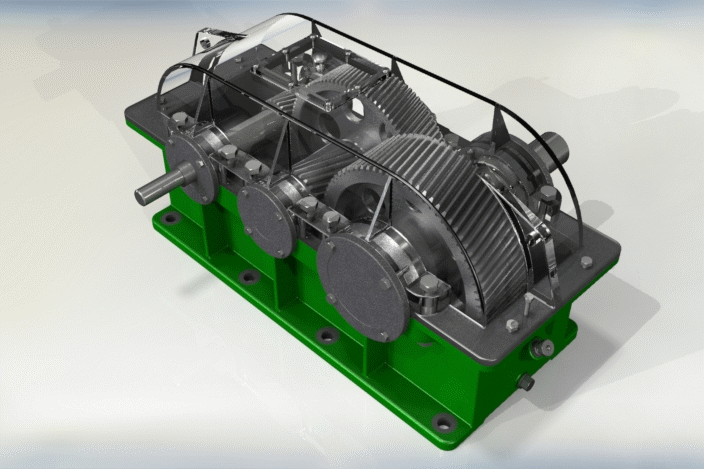

# Projects

### 3D CAD of Dual-Stage Helical Gear Reducer

 One of the most popular 3D CAD models online of a dual-stage helical gear reducer with a total gear ratio of 1:13.26. Available on [GrabCAD](https://grabcad.com/library/dual-stage-helical-gear-reducer-1).

&nbsp;
&nbsp;
&nbsp;

### Barreleye Autograder

 A simple autograder for the computer science courses using GitHub to submit C/C++ programming homework. It can automatically clone/pull and grade the repositories of all students in a class using the instructor-made configurations and grading tests. Available on [GitHub](https://github.com/xinchaosong/barreleye-autograder).

&nbsp;
